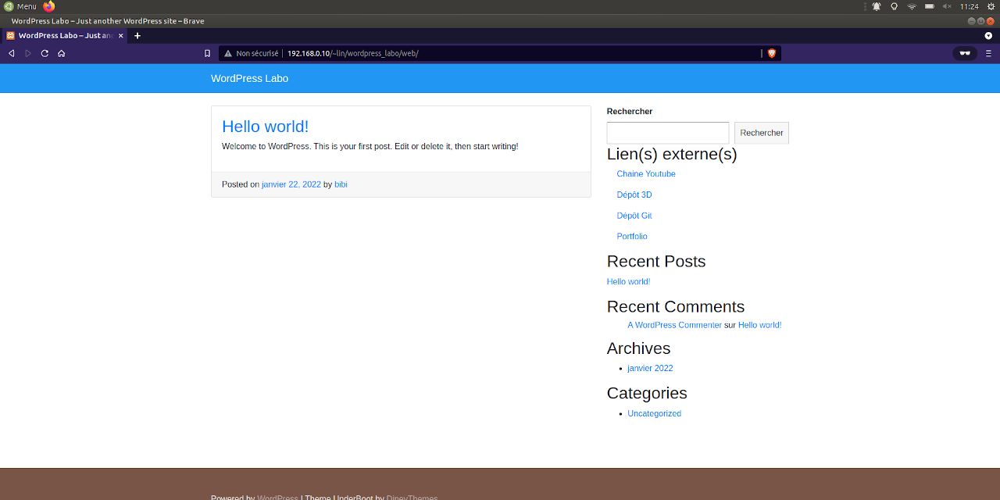

# Widget Liens

Widget WordPress réalisé pour apprendre à développer un plugin, celui-ci affiche une liste de liens provenant d'un fichier `liens.json`.

## Contributing
[makeareadme](https://www.makeareadme.com/)

## License
[MIT](https://choosealicense.com/licenses/mit/)
